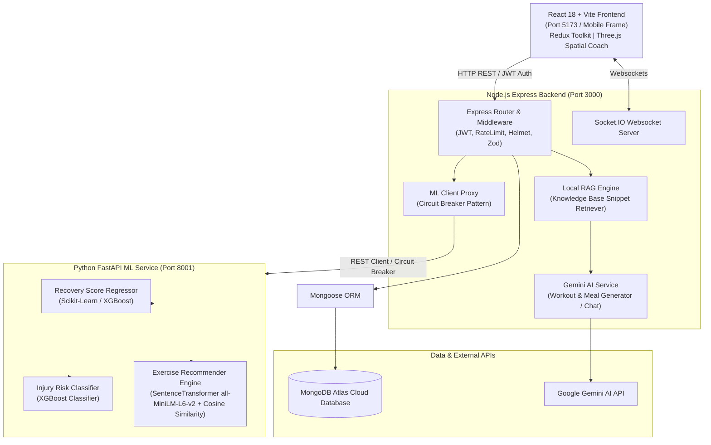
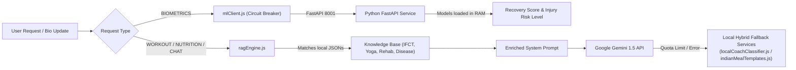

# FitAI — Comprehensive System Architecture & API Call Specification

## 1. Executive Summary & Core Purpose

**FitAI** is an advanced, AI-driven personal health, workout, and nutrition ecosystem. It combines a **React 18 + Vite** web client, a **Node.js Express MERN** backend server, a dedicated **Python FastAPI Machine Learning Inference Engine**, and **Google Gemini AI with Retrieval-Augmented Generation (RAG)** to deliver real-time personalized fitness coaching, recovery scoring, injury risk prevention, and Indian IFCT-based nutritional planning.

---

## 2. High-Level System Architecture

FitAI uses a multi-tier decoupled architecture:



### Component Roles Summary:
1. **Frontend Client (Port 5173)**: React 18, Vite, Redux Toolkit, TailwindCSS, Framer Motion, and Three.js 3D Spatial Avatar. Intercepts outgoing HTTP requests to attach Bearer JWT tokens.
2. **Node.js Express Backend (Port 3000)**: Serves core REST APIs, manages JWT authentication, handles MongoDB persistence via Mongoose, runs the local RAG engine, connects to Google Gemini, and manages Socket.IO events.
3. **Python FastAPI ML Service (Port 8001)**: Dedicated Python inference microservice loading serialized `.pkl` and `.npy` models to perform biometric recovery scoring, injury risk prediction, and exercise vector similarity searching.
4. **Database (MongoDB Atlas)**: Stores user profile data, historical health logs, workout versions, meal plans, ML prediction records, and gamification streaks.

---

## 3. Frontend Architecture & State Management

### 3.1 Tech Stack
- **Framework**: React 18 with Vite build system
- **State Management**: Redux Toolkit (`@reduxjs/toolkit`) + React Redux
- **Styling**: TailwindCSS + Framer Motion animations
- **3D / Canvas**: Three.js / React Three Fiber for interactive 3D spatial coach rendering
- **HTTP Client**: Axios with request/response interceptors

### 3.2 Routing & Route Guards
The application routes are defined in `frontend/src/App.jsx` using `react-router-dom`:

- **Public Routes**: `/` (Landing), `/login`, `/register`, `/forgot-password`, `/verify-reset-otp`, `/reset-password`
- **Protected Routes** (wrapped with `<ProtectedRoute>`):
  - `/dashboard`: Overall metrics, daily progress, streak badges, AI insights
  - `/workouts`: Current workout plan, exercise execution, active workout logger
  - `/nutrition`: Meal plans, macro tracker, Indian IFCT food lookup
  - `/health`: Health metrics, body composition, biometric trends
  - `/health-update`: Health Status Wizard (rebalances workout & diet on completion)
  - `/ai-coach`: Interactive AI fitness coach chat & 3D avatar execution
  - `/calendar`: Workout schedule and history tracking
  - `/profile`: User parameters, equipment inventory, medical conditions

### 3.3 Redux State Slices
State is split into specialized slices inside `frontend/src/redux/slices`:

| Slice Name | Responsibilities | Key Async Thunks / Actions |
| :--- | :--- | :--- |
| `authSlice.js` | User session, JWT token handling, login/register status | `loginUser`, `registerUser`, `fetchMe`, `logout` |
| `workoutSlice.js` | Active workout plans, exercise status, completion logging | `fetchCurrentWorkout`, `generateWorkoutPlan`, `completeWorkout` |
| `nutritionSlice.js` | Daily meal plans, calorie tracking, food search | `fetchMealPlan`, `generateMealPlan`, `logFood` |
| `healthSlice.js` | Biometric metrics, sleep/stress logs, health wizard | `fetchHealthSummary`, `submitHealthUpdate` |
| `gamificationSlice.js` | User streaks, level XP, unlocked badges | `fetchGamificationState` |
| `aiSlice.js` | Chat message history with AI Coach, loading states | `sendMessageToCoach` |
| `uiSlice.js` | Theme toggles, sidebar open/closed, mobile frame mode | `toggleTheme`, `setMobileMode` |

---

## 4. Backend Architecture & Controller Layers

### 4.1 Server Setup (`backend/src/server.js`)
- **Environment Initialization**: Loads `dotenv/config` at the top to prevent missing process variables.
- **Security Middlewares**: `helmet` (CSP configured), `cors()`, `express-rate-limit` (300 requests / 15 min window).
- **Websockets**: `Socket.IO` instance broadcasting real-time server updates (e.g. `insight:new`, `workout:start`, `health:updated`).

### 4.2 Database Models (`backend/src/models`)
- `User.js`: Credentials, physical profile, equipment list, target goals.
- `Workout.js` / `WorkoutVersion.js`: Generated workout plans, exercises, sets, reps, weights, completion status.
- `MealPlan.js`: Daily breakfast, lunch, snack, dinner items, total macros (protein, carbs, fat).
- `HealthUpdate.js` & `HealthMetric.js`: Logged biometric metrics (sleep, stress, soreness, HR, steps, hydration).
- `Injury.js`: Active injuries, body parts, severity level, movement restrictions.
- `Streak.js`: Gamification points, consecutive workout days, level XP.
- `MLPrediction.js`: Historical predictions logged from the FastAPI ML service.

---

## 5. AI Engine & Python Machine Learning Infrastructure

FitAI implements a **hybrid AI/ML approach** blending deterministic local models, Python ML regression/classification, and LLM-based Retrieval-Augmented Generation.



### 5.1 Local RAG Engine (`backend/src/services/ragEngine.js`)
The RAG Engine retrieves evidence-based domain context from curated JSON files inside `backend/knowledge/`:
- `nutrition/indian_ifct_knowledge.json`: Indian Food Composition Tables data.
- `exercise/yoga_mobility_knowledge.json`: Postures, mobility drills, safety rules.
- `exercise/warmup_cooldown_knowledge.json`: Targeted dynamic stretches.
- `rehabilitation/post_surgery_rehab_knowledge.json`: Post-surgery recovery guidelines.
- `mental_health/meditation_stress_knowledge.json`: Stress reduction techniques.
- `disease/chronic_guidelines_knowledge.json`: Guidelines for diabetes, hypertension, etc.

*Algorithm*: Searches keywords across categories, selects the top 4 relevant snippets, and builds zero-hallucination prompts for Gemini API.

### 5.2 Gemini AI Integration (`backend/src/services/aiService.js`)
Uses `@google/generative-ai` to convert user context + RAG snippets into structured JSON payloads for workout generation, meal plan generation, and conversational responses.

### 5.3 Python FastAPI ML Inference Engine (`ml/inference_service.py`)
Runs on port 8001 and pre-loads scikit-learn models into memory at startup:
1. **Recovery Score Regressor (`/predict/recovery`)**: Accepts sleep duration, sleep quality, stress level, resting HR, active HR, steps, hydration, soreness level, age, BMI -> Returns calculated `recovery_score` (0-100) and `limiting_factors`.
2. **Injury Risk Classifier (`/predict/injury`)**: Evaluates workout frequency, session duration, intensity, 7-day sleep, past injuries, age, experience, recovery score -> Returns `injury_risk` (`low`, `medium`, `high`) and probabilities.
3. **Exercise Recommender (`/recommend/exercises`)**: Uses `sentence-transformers` (`all-MiniLM-L6-v2`) to compute cosine similarity between user targets and 2,918 exercises from `megaGymDataset`, applying hard equipment filters and injury exclusions.

### 5.4 Circuit Breaker & Fallback Resilience (`backend/src/services/mlClient.js`)
If 3 consecutive calls to the Python ML service fail, `mlClient` opens the circuit breaker for 60 seconds. During this time (or if Gemini fails), the system seamlessly falls back to:
- Heuristic recovery scoring formula in `utils/fallbacks.js`
- Local exercise generation algorithm in `aiService.js`
- Deterministic Indian food template engine in `indianMealTemplates.js`
- Intent classifier in `localCoachClassifier.js`

---

## 6. Comprehensive API Call Specification

### 6.1 Frontend HTTP Client Setup (`frontend/src/services/api.js`)
- **Base URL**: `/api` (Proxied by Vite dev server to `http://localhost:3000`).
- **Request Interceptor**: Automatically reads `fitai_token` from `localStorage` and appends `Authorization: Bearer <token>` to headers.
- **Response Interceptor**: Automatically clears `localStorage` and redirects on `401 Unauthorized`.

---

### 6.2 Authentication & User Endpoints (`/api/auth`)

#### `POST /api/auth/register`
- **Description**: Creates a new user account.
- **Request Body**:
  ```json
  {
    "name": "Jane Doe",
    "email": "jane@example.com",
    "password": "SecurePassword123"
  }
  ```
- **Response (201 Created)**:
  ```json
  {
    "token": "eyJhbGciOiJIUzI1Ni...",
    "user": { "id": "60d5ec...", "name": "Jane Doe", "email": "jane@example.com" }
  }
  ```

#### `POST /api/auth/login`
- **Description**: Authenticates user and returns JWT token.
- **Request Body**:
  ```json
  {
    "email": "jane@example.com",
    "password": "SecurePassword123"
  }
  ```
- **Response (200 OK)**:
  ```json
  {
    "token": "eyJhbGciOiJIUzI1Ni...",
    "user": { "id": "60d5ec...", "name": "Jane Doe" }
  }
  ```

#### `GET /api/auth/me`
- **Description**: Returns authenticated user profile data.
- **Headers**: `Authorization: Bearer <token>`
- **Response (200 OK)**: Full user object with profile parameters, goals, equipment list, and active injuries.

---

### 6.3 Workout Endpoints (`/api/workouts`)

#### `GET /api/workouts/current`
- **Description**: Retrieves active workout plan for the user.
- **Response (200 OK)**: Workout plan object containing split name, list of targeted exercises, sets, reps, target muscle groups, and completion status.

#### `POST /api/workouts/generate`
- **Description**: Generates an AI-customized workout plan.
- **Request Body**:
  ```json
  {
    "fitnessGoal": "muscle_gain",
    "equipment": ["dumbbell", "barbell"],
    "targetMuscles": ["chest", "triceps"]
  }
  ```
- **Execution Flow**:
  1. Retrieves active user injuries and restrictions.
  2. Queries Local RAG engine for movement guidelines.
  3. Calls Gemini AI API (or falls back to Python ML Recommender).
  4. Persists plan in MongoDB `Workout` collection.
- **Response (200 OK)**: Generated workout document.

#### `POST /api/workouts/complete`
- **Description**: Logs workout completion and updates user streak/XP.
- **Request Body**: `{ "workoutId": "65b...", "durationMinutes": 45, "perceivedExertion": 8 }`

---

### 6.4 AI & ML Endpoints (`/api/ai` & `/api/ml`)

#### `POST /api/ai/coach/chat`
- **Description**: Sends a message to the FitAI Coach assistant.
- **Request Body**: `{ "message": "How can I reduce knee pain while squatting?" }`
- **Response (200 OK)**:
  ```json
  {
    "reply": "Based on orthopedic mobility guidelines, focus on terminal knee extensions...",
    "source": "rag_gemini_hybrid"
  }
  ```

#### `POST /api/ml/recovery`
- **Description**: Proxy route to Python FastAPI ML recovery predictor.
- **Request Body**:
  ```json
  {
    "sleep_duration": 7.5,
    "sleep_quality": 85,
    "stress_level": 25,
    "resting_hr": 60,
    "active_hr": 120,
    "steps": 9000,
    "hydration": 3.0,
    "soreness_level": 2,
    "age": 28,
    "bmi": 22.4
  }
  ```
- **Response (200 OK)**:
  ```json
  {
    "recovery_score": 88.5,
    "recovery_level": "Optimal",
    "limiting_factors": ["None — Biometrics Balanced"],
    "top_contributors": { "sleep": 0.35, "soreness": 0.30, "stress": 0.20, "hr_delta": 0.15 }
  }
  ```

#### `POST /api/ml/injury-risk`
- **Description**: Proxy route to Python FastAPI ML injury risk classifier.
- **Response (200 OK)**:
  ```json
  {
    "injury_risk": "low",
    "risk_probability": 0.92,
    "risk_breakdown": { "low": 0.92, "medium": 0.06, "high": 0.02 },
    "warning_message": "Training parameters within healthy envelope."
  }
  ```

#### `POST /api/ml/recommend`
- **Description**: Queries Python exercise vector space for cosine-similar exercises.

---

### 6.5 Health & Health Update Wizard Endpoints (`/api/health`)

#### `POST /api/health/update`
- **Description**: Submits daily/weekly health wizard parameters and triggers instant plan rebalancing.
- **Request Body**:
  ```json
  {
    "sleepQuality": 40,
    "sorenessLevel": 8,
    "stressLevel": 70,
    "activeInjuries": [{ "bodyPart": "knee", "severity": "medium" }]
  }
  ```
- **Execution Flow**:
  1. Saves `HealthUpdate` document in database.
  2. Invokes Python ML recovery and injury risk endpoints.
  3. Rebalances active workout plan (e.g. substitutes high-impact leg movements with lower-impact core/upper-body exercises).
  4. Emits `health:updated` Socket.IO event to connected client.
- **Response (200 OK)**: `{ "success": true, "rebalanced": true, "recoveryScore": 42.0 }`

---

### 6.6 Nutrition & Meal Plan Endpoints (`/api/nutrition`)

#### `GET /api/nutrition/today`
- **Description**: Returns today's active meal plan and macro goals.

#### `POST /api/nutrition/generate`
- **Description**: Generates an Indian IFCT diet plan based on user macro targets.
- **Request Body**: `{ "dietaryPreference": "vegetarian", "targetCalories": 2200 }`

---

## 7. Real-Time Socket.IO Communication Architecture

Socket.IO handles real-time bidirectional messaging between server and client:

| Event Name | Direction | Payload | Trigger / Purpose |
| :--- | :--- | :--- | :--- |
| `workout:start` | Client -> Server | `{ "workoutId": "..." }` | User initiates live workout timer |
| `health:updated` | Client -> Server | `{ "healthUpdateId": "..." }` | User finishes health wizard |
| `insight:new` | Server -> Client | `{ "message": "Workouts rebalanced!" }` | Broadcasts real-time coach notifications |

---

## 8. Summary of End-to-End Execution Flow

1. **User Authentication**: Client posts credentials to `/api/auth/login` -> Backend validates password via bcrypt -> Returns JWT -> Client stores token in `localStorage`.
2. **Dashboard Initialization**: Client Redux dispatches `fetchMe()`, `fetchCurrentWorkout()`, `fetchGamificationState()` -> Request interceptor injects Bearer JWT -> Backend returns database entities.
3. **Health Wizard Submission**: User submits daily biometrics -> Backend calls Python FastAPI `/predict/recovery` and `/predict/injury` via `mlClient.js` (protected by Circuit Breaker) -> Backend updates MongoDB -> Socket.IO emits `insight:new` notification -> Redux updates UI seamlessly.
