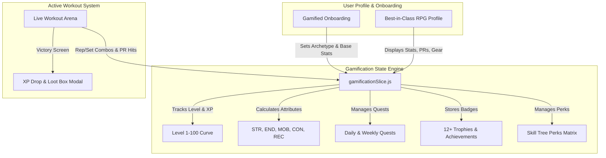

# Gamification & Engagement Architecture Plan for FitAI 🚀

This document outlines the master technical and design plan to gamify the entire FitAI platform—turning workouts, user profiles, onboarding, nutrition, and health tracking into an addictive, RPG-powered fitness experience.

---

## 🎯 Primary Goals & System Vision

1. **Gamified Live Workout Arena**: Replace static workout cards with an interactive **Live Workout Mode** featuring real-time rep/set tracking, set rest timers, combo multipliers, sound/visual feedback, PR Boss Fights, and Post-Workout Loot/XP drops.
2. **Best-in-Class RPG User Profile**: A showcase profile featuring an RPG Character Identity Card, 5-Axis Attribute Radar (STR, END, MOB, CON, REC), Trophy & Achievement Showcase, PR Hall of Fame, Equipment Loadout Grid, and an unlockable Skill Tree / Perk System.
3. **Best-in-Class RPG User Onboarding**: An immersive 5-step character creation flow where users pick their **Fitness Archetype** (*Strength Juggernaut*, *Endurance Sentinel*, *Mobility Monk*, *Hybrid Titan*), define their stats, set targets, sync telemetry, and undergo a 3D Coach ritual to claim a +500 XP Starter Pack.
4. **Platform-Wide Gamification Loop**: Integrate Daily Quests, Streak Flames, Level XP bars, Fuel Mana Gauges (Nutrition), and 3D Coach Affinity Levels across all app sections.

---

## 🛠 Architectural Overview & Data Model

---

## 📋 Component Implementation Architecture

### 1. State Management & Data Core (`redux/slices`)

#### `gamificationSlice.js`
- Core Redux slice managing:
  - **Level & XP**: Current XP, XP needed for next level, level rank title (*"Novice Lifter"* -> *"Iron Nomad"* -> *"Cyber Titan"* -> *"Apex Legend"*).
  - **RPG Attributes**: 5-axis values (0-100) for `strength`, `endurance`, `mobility`, `consistency`, `recovery`.
  - **Daily Quests**: Array of 3 daily challenges (e.g. *"Log 1 Workout"*, *"Hit 10,000kg Total Volume"*, *"Maintain 50g+ Protein"*) with claimable XP buttons.
  - **Achievements & Badges**: 12+ badges (e.g., *"Iron Vanguard"*, *"Century Reps"*, *"Clinical Sentinel"*, *"Streak Master"*).
  - **PR Hall of Fame**: Records for Bench Press, Squat, Deadlift, 5K Run, Pull-ups.
  - **Skill Tree Perks**: Passive perks unlocked at Levels 5, 10, 15, 20 (e.g., *+10% XP Booster*, *Recovery Surge*, *Overload Mastery*).

---

### 2. Workouts Section — Gamified Arena & Player (`components/workout`)

#### `LiveWorkoutArena.jsx`
- **Interactive Fullscreen Live Workout Runner**:
  - Active set tracker with checkable sets, weight/rep adjusters, rest countdown timer with audio chime, and exercise switcher.
  - **Live Set Combo Multiplier**: Dynamic display (e.g. `🔥 3x PERFECT SET COMBO! +50 XP`).
  - **PR Boss Fight Banner**: Appears when performing heavy sets (e.g. `⚔️ BOSS BATTLE: Bench Press 85kg — 5 Reps to Defeat!`).
  - **Live Sound & Audio Feedback**: Audio chimes for set completion, rest timer zero, combo triggers, and workout victory.

#### `WorkoutVictoryModal.jsx`
- **Post-Workout Loot & Victory Drop**:
  - Animated victory banner with particle effects.
  - XP gained breakdown (Base XP + Combo Bonus + PR Bonus).
  - Level progress bar animation.
  - Stat attribute gains (+2 STR, +1 END).
  - Unlocked badges/loot card alert.

---

### 3. User Profile Section — Best-in-Class RPG Profile (`components/profile`)

#### `GamifiedProfile.jsx`
- **Best-in-Class RPG Character Card & Identity Header**:
  - Avatar with animated glowing rank aura frame based on level.
  - Level Badge & Rank Title (e.g. *Level 14 - Cyber Titan*).
  - XP progress bar to next rank.
  - Quick Archetype badge (*Strength Juggernaut*, etc.).
- **5-Axis SVG Radar Chart**:
  - Visual polygon chart plotting Strength, Endurance, Mobility, Consistency, and Recovery.
- **Achievement Showcase Grid**:
  - Rarity badges (Common, Rare, Epic, Legendary) with progress indicators and unlock dates.
- **PR Hall of Fame Widget**:
  - Interactive grid displaying personal records with date badges and video/weight history.
- **Skill Tree Perks Matrix**:
  - Tree of unlockable perks with lock/unlock status and active bonus tooltips.

---

### 4. User Onboarding Section — RPG Character Creation Flow (`components/profile`)

#### `GamifiedOnboarding.jsx`
- **5-Step RPG Character Creation Flow**:
  1. **Step 1: Archetype Selection**: Interactive card picker for *Strength Juggernaut*, *Endurance Sentinel*, *Mobility Monk*, and *Hybrid Titan*.
  2. **Step 2: Base Telemetry & Clinical AI Intake**: Age, height, weight sliders + medical intake with live attribute calculation.
  3. **Step 3: Goal & Loadout Customization**: Pick fitness targets and unlock starting gear slots.
  4. **Step 4: Smartwatch Sensor Telemetry Sync**: Wearable connection simulation with +100 XP initial sync reward.
  5. **Step 5: 3D Coach Initiation Ritual**: 3D Coach welcome message, awarding +500 XP Starter Pack, unlocking Tier 1 Badge.

---

## 🧪 Verification & Results
- Verified clean build (`npm run build`).
- Live RPG Gamification Engine active on `/profile`, `/onboarding`, `/workouts`, and `/dashboard`.
